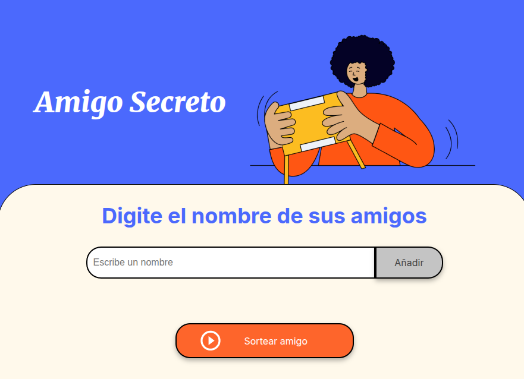

<h1 align="center">🎁 Challenge: Amigo Secreto 🎉</h1>

  Una app web simple y divertida para organizar sorteos de Amigo Secreto. Ideal para celebraciones, cumpleaños o eventos entre amigos. 🧑‍🤝‍🧑✨

<h2 align="center">🖼️ Vista previa</h2>

  

---

## 📌 Descripción del proyecto

Este proyecto está desarrollado con **HTML, CSS y JavaScript**. Permite a los usuarios agregar nombres a una lista y luego sortear aleatoriamente a un "amigo secreto".

Está pensado para quienes quieran organizar juegos de intercambio de regalos entre amigos, familiares o compañeros de trabajo de forma rápida y sencilla.

---

## ✅ Funcionalidades

- 🧾 Agregar nombres de participantes.
- 📋 Mostrar la lista de amigos agregados.
- 🎲 Realizar un sorteo aleatorio.
- 🪄 Mostrar el resultado del amigo secreto en pantalla.
- 🚨 Validación: al menos 2 participantes requeridos para sortear.

---

## 🚀 ¿Cómo pueden usarlo los usuarios?

1. 🖊️ Escribe el nombre de un participante en el campo de texto.
2. ➕ Haz clic en el botón **"Agregar"**.
3. 🔁 Repite el proceso para todos los participantes.
4. 🧙‍♂️ Haz clic en **"Sortear"** para conocer el amigo secreto.

> ⚠️ El proyecto funciona directamente desde el navegador. Solo necesitas abrir el archivo `index.html`.

---
## ⚙️ Instalación y uso

Este proyecto **no requiere instalación ni dependencias externas**. Para usarlo, sigue estos pasos:

1. 📥 **Descarga el proyecto en formato ZIP** desde este repositorio:
   - Haz clic en el botón verde **“Code”** (arriba a la derecha).
   - Luego selecciona **“Download ZIP”**.
   - Extrae el contenido del archivo ZIP en tu computadora.

2. 🧭 Abre el archivo `index.html` en tu navegador (doble clic o clic derecho → “Abrir con”).

3. 🎉 ¡Listo! Ya puedes usar el Sorteador de Amigo Secreto sin necesidad de instalar nada.

## 👩‍💻 Autor

- **Nombre:** Floriceli Gonzales  
- **GitHub:** [@floriceligonz](https://github.com/floriceligonz)  
- **Tecnologías utilizadas:** HTML, CSS, JavaScript

---

  💫 ¡Gracias por visitar este repositorio

